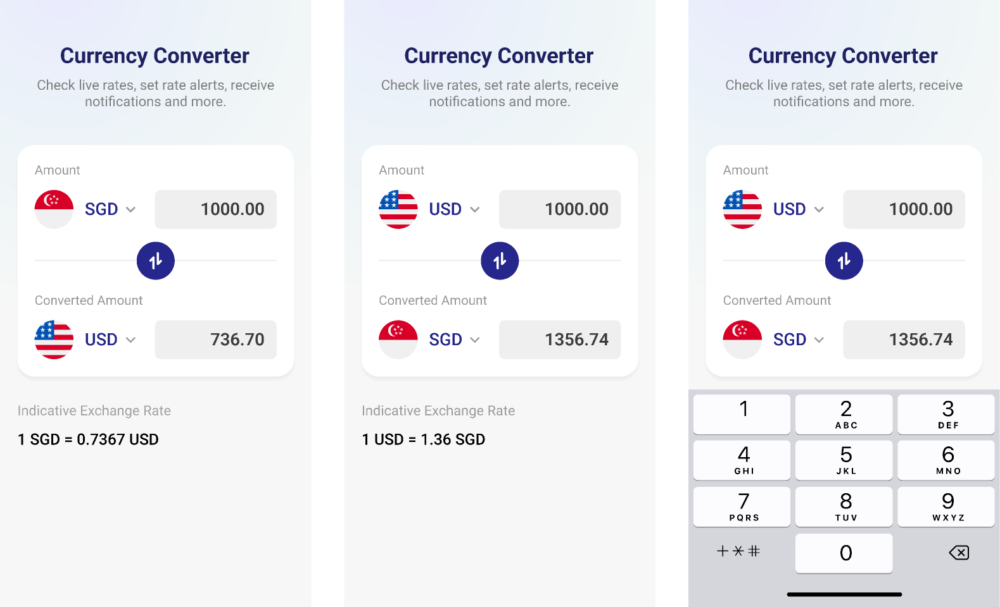

# Web interview

You will be provided with an incomplete Vue3 web application that fetches information about currencies and allows the user to use a converter with these currencies.

## Goal

Your goal in this excercise is to finish completing the web application that is currently incomplete by finishing the most of the ```TODO``` statements.

## Tasks 
### Currency Card component
- Fix the CurrencyCard component that is displaying some information incorrectly.
### Router
- Fix the route of the converter to the correct path. ```/converter```
### Navbar
- In the Navbar.vue use the directions constant to create the links by iterating over them instead of adding each one individually.

### CurrenciesView
- Fix the commented line that pushes all the currencies into the currencies reactive property that makes the application crash.
- Show a loader or a text that indicates that the view is loading while the call is done
- Show a view if there are no currencies
- By using a computed property allow to filter the currencies by name or code case insensitive using the search reactive property.
- Implement the fetch in the correct lifecycle hook of vuejs.


### ConverterView
The converter view currently is under construction and only the reactive properties that are going to be used in the view are going to be implemented. You neeed to create a converter of the currencies (the UI of the converter view does not need to be elegant only functional) using the API of FXRates.
https://fxratesapi.com/docs/endpoints/convert-currency




You can use the previous image as a base for the UI.

## Extras

There are some extras that are optional in this excercise but will be a great addition to the application if they are implemented.

### CurrenciesView
- You can group the currencies into the following groups and display the separately:
    - Crypto currencies: The ones where decimal_digits > 2
    - Fiat currencies: The ones where decimal_digits = 2

### Historic View

Add a Historic view implementing the following endpoint https://fxratesapi.com/docs/endpoints/historical-rates.


### State management
Instead of fetching the currencies all over again in the converter page implement Pinia to store the currencies avoiding to call the API twice.


## Helpers

## VueJS
 - Conditional rendering: https://vuejs.org/guide/essentials/conditional.html
 - List Rendering: https://vuejs.org/guide/essentials/list.html
 - Lifecycle Hooks: https://vuejs.org/guide/essentials/lifecycle.html
 - Computed properties: https://vuejs.org/guide/essentials/computed.html
 - Setup; https://vuejs.org/api/composition-api-setup.html


 ## Vue Router
 - Named routes: https://router.vuejs.org/guide/essentials/named-routes.html

 ## Js
 - Object static methods: https://developer.mozilla.org/en-US/docs/Web/JavaScript/Reference/Global_Objects/Object#static_methods


## Axios
- Documentation: https://github.com/axios/axios

## Pinia
- Documentation: https://pinia.vuejs.org/
